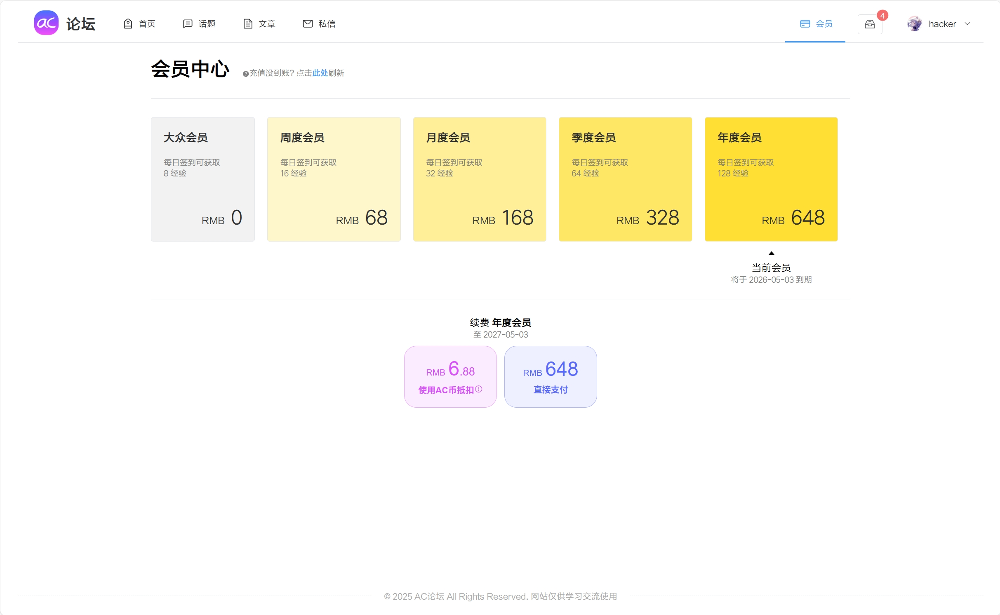

# 在线论坛系统

> 该系统为我的本科毕业设计，存在诸多因现实情况而作取舍的地方，轻喷 :)

### 系统概述

> 节选自毕业论文

该系统将提供以下主要功能：登录注册（包括找回密码等）、话题板块（发布话题、管理话题、浏览话题等）、文章板块（发布文章、编辑文章、浏览文章、评论、收藏、点赞、转发等）、私信板块（向其他用户发起聊天等）、会员板块（购买会员、享受相应权益等）、钱包板块（通过充值打赏作者、查看余额以及消费记录等）、消息板块（接收来自系统或管理员的通知等）、账户板块（修改个人信息、账户等级计算等）、个人空间板块（展示作者信息以及主要作品、点赞或收藏过的作品、粉丝以及关注等）、创作中心板块（提供给创作者的数据看板等）、管理板块（提供给管理员的运行维护工具，如手动同步数据库数据、查看当前在线人数等）

### 运行前准备

#### 1. 运行环境

后端：`JDK 21.0.2`

前端：`node.js 22.16.0`

#### 2. 数据库

作者使用的数据库版本如下，请酌情选择合适的版本

|      数据库      |   版本   |
|:-------------:|:------:|
|     MySQL     | 8.0.32 |
|     Redis     | 6.2.12 |
| Elasticsearch | 8.17.2 |

> 注: 请使用 [init.sql](init.sql) 初始化 MySQL 数据库

> 注: Elasticsearch 需要安装 ik 分词器

- MySQL 的默认端口为 `3306`，用户名为 `root`，密码为 `123456`，库名为 `ac_forum`，有需要请自行修改 [application.yml](backend/src/main/resources/application-dev.yml)
- Redis 的默认端口为 `6379`，密码为 `123456`，库号为 `1`，有需要请自行修改 [application.yml](backend/src/main/resources/application-dev.yml)
- Elasticsearch 的默认端口为 `9002`，用户名为 `elastic`，密码为 `123456`，有需要请自行修改 [application.yml](backend/src/main/resources/application-dev.yml)

#### 3. 申请腾讯云邮箱发信地址

[发信地址 - 邮件配置 - 邮件推送 - 控制台](https://console.cloud.tencent.com/ses/address)

#### 4. 开通腾讯云COS对象存储服务

[存储桶列表 - 对象存储 - 控制台](https://console.cloud.tencent.com/cos/bucket)

请选择**私有读写**

#### 5. 开通支付宝Web支付服务（沙盒）

[沙箱应用 - 开放平台](https://open.alipay.com/develop/sandbox/app)

请选择**系统默认秘钥 - 公钥模式**

### 运行指南

#### 1. 配置环境变量

|                   环境变量名                    |       环境变量值       |                          备注                           |
|:------------------------------------------:|:-----------------:|:-----------------------------------------------------:|
|   ac_forum_tencent_cloud_email_username    |     腾讯云发信邮箱账号     |                                                       |
|   ac_forum_tencent_cloud_email_password    |     腾讯云发信邮箱密码     |                                                       |
|               jwt_secretkey                |      JWT 私钥       |                                                       |
|       ac_forum_tencent_cos_secretId        | 腾讯云对象存储 secretId  |                                                       |
|       ac_forum_tencent_cos_secretKey       | 腾讯云对象存储 secretKey |                                                       |
|      ac_forum_tencent_cos_bucketName       |    腾讯云对象存储存储桶名    |                  形如 `xxx-123456789`                   |
| ac_forum_tencent_cos_bucketResourcePrepend |    腾讯云对象存储资源前缀    | 形如 `qcs::cos:ap-nanjing:uid/123456789:xxx-123456789/` |
|        ac_forum_tencent_cos_region         |   腾讯云对象存储存储桶地区    |                    形如 `ap-nanjing`                    |
|   ac_forum_tencent_cos_objectUrlPrepend    | 腾讯云对象存储 http 资源前缀 |         可选源站域名或加速域名，形如 `https://cdn.xxx.com`          |
|       ac_forum_alipay_appPrivateKey        |      支付宝应用私钥      |                         沙盒应用                          |
|      ac_forum_alipay_alipayPublicKey       |       支付宝公钥       |                         沙盒公钥                          |
|           ac_forum_alipay_appId            |     支付宝应用 Id      |                        沙盒应用 Id                        |

#### 2. 启动后端服务

使用 `maven` 下载所有依赖后，启动后端。

#### 3. 启动前端服务

使用 `npm` 下载所有依赖后，`npm dev` 启动前端。

#### 4. 访问浏览器

访问 `http://localhost:9001` 即可进入系统。

请注意，创建的第一个账号并没有管理员权限，请进入数据库 `user` 表修改 `user_type` 字段为 `0` 即可。

### 效果预览

> 数据来源于百度贴吧，若有侵权请提 issue 删除

#### 首页

#### 话题页

#### 文章页

#### 文章详情页

#### 文章编辑页

#### 私信页

#### 会员页

#### 账户管理页

#### 个人空间页

#### 创作空间页

### 系统缺陷

- 从 MySQL 到 Elasticsearch 的同步基于粗暴的异步双写模式，而非使用 `canal` 等工具基于 `binlog` 同步，存在数据不一致风险
- 前端界面在不同屏幕比例下可能出现错位